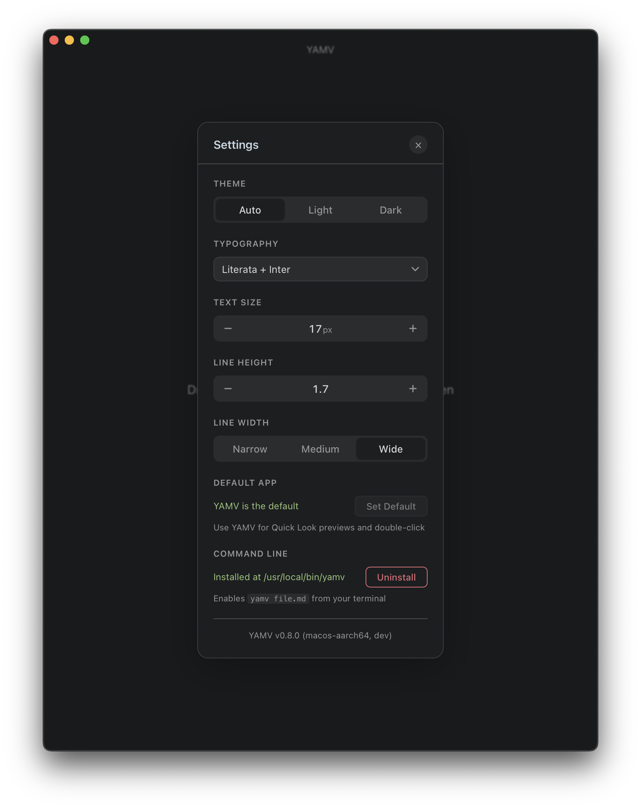

<p align="center">
  
</p>

<h1 align="center">YAMV</h1>
<p align="center"><strong>Yet Another Markdown Viewer</strong></p>
<p align="center">A fast, native markdown viewer for macOS, Windows, and Linux.</p>

---

## Why YAMV?

Most markdown tools are editors first, viewers second. YAMV is a **dedicated viewer** — open a `.md` file and read it beautifully rendered, with live-reload when the file changes on disk.

Use your favorite text editor to write. Use YAMV to read.

## Features

- **QuickLook preview** — press Space on any `.md` file in Finder to see a fully rendered preview with syntax highlighting, math, and diagrams
- **Live reload** — automatically re-renders when the file changes on disk
- **Rich markdown** — GFM tables, task lists, footnotes, emoji, abbreviations, definition lists, `==highlights==`, and math (KaTeX)
- **Mermaid diagrams** — flowcharts, sequence diagrams, and more, rendered inline
- **Syntax highlighting** — powered by highlight.js with theme-aware colors
- **Light & dark themes** — Bear-inspired Red Graphite and Dark Graphite color schemes, with system preference detection
- **Table of contents** — auto-generated sidebar for quick navigation
- **Search** — find text within the rendered document
- **Drag & drop** — drop a markdown file onto the window to open it
- **Edit in Editor** — press `Cmd+E` to open the current file in your preferred editor
- **Default app registration** — set YAMV as your default `.md` viewer from Settings for QuickLook and double-click support
- **Remembers state** — window size, position, scroll location, and settings persist across sessions

## Installation

Download the latest release for your platform:

| Platform | Download | Notes |
|---|---|---|
| **macOS** (Intel & Apple Silicon) | `.dmg` | Works on all Macs |
| **Windows** (64-bit) | `.exe` Installer | Recommended |
| **Windows** (64-bit) | `.msi` Installer | Alternative for IT admins / GPO |
| **Linux** (Debian/Ubuntu) | `.deb` | `sudo dpkg -i YAMV_*.deb` |
| **Linux** (Fedora/RHEL) | `.rpm` | `sudo rpm -i YAMV-*.rpm` |
| **Linux** (Universal) | `.AppImage` | No install needed — just run it |

**[Download latest release](https://github.com/martinemmert/yet-another-markdown-viewer/releases/latest)** — pick the file matching your platform.

### macOS first launch

macOS will show a warning that the app is from an unidentified developer. To open it:

1. **Right-click** (or Control-click) on **YAMV** in your Applications folder and select **Open**
2. In the dialog that appears, click **Open** to confirm
3. You only need to do this once — after that, the app opens normally

If that doesn't work, go to **System Settings → Privacy & Security**, scroll down, and click **Open Anyway** next to the message about YAMV.

<details>
<summary>Alternative: using the Terminal</summary>

Open **Terminal** (found in Applications → Utilities) and paste:
```sh
xattr -cr /Applications/YAMV.app
```
Press Enter, then open the app again.
</details>

## Usage

- **Open a file:** `File → Open` or drag a `.md` file onto the window
- **CLI:** `yamv path/to/file.md`
- **Settings:** `Cmd+,` (macOS) / `Ctrl+,` to adjust theme, font, text size, line height, and content width

<p align="center">
  
</p>

### QuickLook (macOS)

Press **Space** on any `.md` file in Finder to see a fully rendered preview — complete with syntax highlighting, KaTeX math, and Mermaid diagrams. Works in both light and dark mode.

### Set as default markdown viewer (macOS)

Open **Settings** (`Cmd+,`) and click **Set Default** under *Default App*. This registers YAMV for:

- **Quick Look** previews (Space bar in Finder)
- **Double-click** to open `.md` files directly in YAMV
- **"Open with"** context menu in Finder

### Edit in your favorite editor

Press `Cmd+E` to open the current file in your preferred editor. Configure which app to use in **Settings** under *Editor* (e.g. "Visual Studio Code", "Cursor", "Sublime Text").

## Built With

[Tauri v2](https://tauri.app) · [markdown-it](https://github.com/markdown-it/markdown-it) · [highlight.js](https://highlightjs.org) · [Mermaid](https://mermaid.js.org) · [KaTeX](https://katex.org)

## License

MIT
