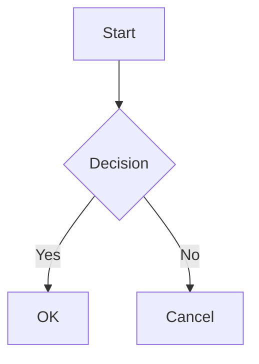

# YAMV Implementation Plan

> **For Claude:** REQUIRED SUB-SKILL: Use superpowers:executing-plans to implement this plan task-by-task.

**Goal:** Build a fast native macOS markdown viewer with Tauri v2, markdown-it, and GitHub-styled rendering.

**Architecture:** Tauri v2 app with Rust backend (file I/O, watching, CLI) and vanilla JS frontend (markdown-it rendering pipeline). No framework. Vite for build.

**Tech Stack:** Tauri v2, Rust, vanilla JS, Vite, markdown-it + plugins, highlight.js, KaTeX, Mermaid

**Security note:** This app renders local markdown files from the user's own filesystem. HTML passthrough and innerHTML usage are deliberate design choices — there is no untrusted content. The markdown-it pipeline handles escaping for non-HTML content by default.

---

### Task 1: Install Rust Toolchain

**Step 1: Install Rust via rustup**

Run:
```bash
curl --proto '=https' --tlsv1.2 -sSf https://sh.rustup.rs | sh -s -- -y
```

**Step 2: Verify installation**

Run:
```bash
source "$HOME/.cargo/env" && rustc --version && cargo --version
```
Expected: Version numbers for both rustc and cargo.

---

### Task 2: Scaffold Tauri v2 Project

**Files:**
- Create: full project scaffold via `npm create tauri-app`

**Step 1: Initialize the Tauri project**

Run from the project root `/Users/martinemmert/Work/03_projects/yet-another-markdown-viewer`:
```bash
npm create tauri-app@latest . -- --template vanilla --manager npm --yes
```

If the interactive CLI doesn't support `--yes`, run it interactively and choose:
- Template: Vanilla
- Package manager: npm
- App name: yamv

**Step 2: Verify scaffold**

Run:
```bash
ls src-tauri/src/main.rs src-tauri/Cargo.toml src-tauri/tauri.conf.json package.json vite.config.js index.html
```
Expected: All files exist.

**Step 3: Install npm dependencies**

Run:
```bash
npm install
```

**Step 4: Verify it builds and opens**

Run:
```bash
npm run tauri dev
```
Expected: A Tauri window opens with the default template content. Close it.

**Step 5: Commit**

```bash
git init
```

Create `.gitignore`:
```
node_modules/
src-tauri/target/
dist/
.DS_Store
```

```bash
git add -A
git commit -m "chore: scaffold Tauri v2 vanilla project"
```

---

### Task 3: Install Frontend Dependencies

**Files:**
- Modify: `package.json`

**Step 1: Install markdown-it and all plugins**

Run:
```bash
npm install markdown-it markdown-it-footnote markdown-it-emoji markdown-it-abbr markdown-it-deflist markdown-it-anchor markdown-it-toc-done-right markdown-it-front-matter
```

**Step 2: Install highlight.js and KaTeX**

Run:
```bash
npm install highlight.js katex
```

**Step 3: Install Mermaid**

Run:
```bash
npm install mermaid
```

**Step 4: Commit**

```bash
git add package.json package-lock.json
git commit -m "chore: add markdown rendering dependencies"
```

---

### Task 4: Build the Markdown Rendering Pipeline

**Files:**
- Create: `src/renderer.js`

**Step 1: Create the renderer module**

Create `src/renderer.js` with the full markdown-it pipeline:

```javascript
import markdownit from "markdown-it";
import footnote from "markdown-it-footnote";
import emoji from "markdown-it-emoji";
import abbr from "markdown-it-abbr";
import deflist from "markdown-it-deflist";
import anchor from "markdown-it-anchor";
import tocDoneRight from "markdown-it-toc-done-right";
import frontMatter from "markdown-it-front-matter";
import hljs from "highlight.js";
import katex from "katex";

let frontMatterContent = null;

const md = markdownit({
  html: true,
  linkify: true,
  typographer: true,
  highlight(str, lang) {
    if (lang && hljs.getLanguage(lang)) {
      try {
        return `<pre class="hljs"><code>${hljs.highlight(str, { language: lang }).value}</code></pre>`;
      } catch (_) {
        /* fallback below */
      }
    }
    return `<pre class="hljs"><code>${md.utils.escapeHtml(str)}</code></pre>`;
  },
});

// GFM-style plugins
md.use(footnote);
md.use(emoji);
md.use(abbr);
md.use(deflist);
md.use(anchor, { permalink: anchor.permalink.headerLink() });
md.use(tocDoneRight);
md.use(frontMatter, (fm) => {
  frontMatterContent = fm;
});

// KaTeX inline math: $...$
function mathInline(state, silent) {
  if (state.src[state.pos] !== "$") return false;
  if (state.src[state.pos + 1] === "$") return false;

  const start = state.pos + 1;
  let end = start;
  while (end < state.posMax && state.src[end] !== "$") {
    if (state.src[end] === "\\") end++;
    end++;
  }
  if (end >= state.posMax) return false;
  if (!silent) {
    const token = state.push("math_inline", "math", 0);
    token.markup = "$";
    token.content = state.src.slice(start, end);
  }
  state.pos = end + 1;
  return true;
}

// KaTeX block math: $$...$$
function mathBlock(state, startLine, endLine, silent) {
  const startPos = state.bMarks[startLine] + state.tShift[startLine];
  if (startPos + 2 > state.eMarks[startLine]) return false;
  if (state.src.slice(startPos, startPos + 2) !== "$$") return false;
  if (silent) return true;

  let nextLine = startLine;
  let found = false;
  while (++nextLine < endLine) {
    const lineStart = state.bMarks[nextLine] + state.tShift[nextLine];
    const lineEnd = state.eMarks[nextLine];
    if (state.src.slice(lineStart, lineEnd).trim() === "$$") {
      found = true;
      break;
    }
  }
  if (!found) return false;

  const token = state.push("math_block", "math", 0);
  token.block = true;
  token.content = state.getLines(startLine + 1, nextLine, state.tShift[startLine], true);
  token.map = [startLine, nextLine + 1];
  token.markup = "$$";
  state.line = nextLine + 1;
  return true;
}

md.inline.ruler.after("escape", "math_inline", mathInline);
md.block.ruler.after("blockquote", "math_block", mathBlock, {
  alt: ["paragraph", "reference", "blockquote", "list"],
});

md.renderer.rules.math_inline = (tokens, idx) => {
  try {
    return katex.renderToString(tokens[idx].content, { throwOnError: false });
  } catch (e) {
    return `<span class="katex-error">${md.utils.escapeHtml(tokens[idx].content)}</span>`;
  }
};

md.renderer.rules.math_block = (tokens, idx) => {
  try {
    return `<div class="katex-block">${katex.renderToString(tokens[idx].content, {
      throwOnError: false,
      displayMode: true,
    })}</div>`;
  } catch (e) {
    return `<div class="katex-error">${md.utils.escapeHtml(tokens[idx].content)}</div>`;
  }
};

// Post-render hooks for extensibility
const postRenderHooks = [];

export function addPostRenderHook(fn) {
  postRenderHooks.push(fn);
}

function renderFrontMatter(fm) {
  if (!fm) return "";
  return `<details class="front-matter"><summary>Front Matter</summary><pre><code class="language-yaml">${md.utils.escapeHtml(fm)}</code></pre></details>`;
}

export function render(markdown) {
  frontMatterContent = null;
  const html = md.render(markdown);
  const fmHtml = renderFrontMatter(frontMatterContent);
  return fmHtml + html;
}

export async function postRender(container) {
  // Render Mermaid diagrams
  const mermaidBlocks = container.querySelectorAll("code.language-mermaid");
  if (mermaidBlocks.length > 0) {
    const mermaid = (await import("mermaid")).default;
    mermaid.initialize({
      startOnLoad: false,
      theme: window.matchMedia("(prefers-color-scheme: dark)").matches
        ? "dark"
        : "default",
    });
    for (let i = 0; i < mermaidBlocks.length; i++) {
      const block = mermaidBlocks[i];
      const pre = block.parentElement;
      const graphDef = block.textContent;
      try {
        const { svg } = await mermaid.render(`mermaid-${i}`, graphDef);
        const div = document.createElement("div");
        div.className = "mermaid-diagram";
        // Safe: SVG generated by Mermaid library from local file content
        div.innerHTML = svg;
        pre.replaceWith(div);
      } catch (e) {
        pre.classList.add("mermaid-error");
      }
    }
  }

  // Run custom post-render hooks
  for (const hook of postRenderHooks) {
    await hook(container);
  }
}
```

**Step 2: Commit**

```bash
git add src/renderer.js
git commit -m "feat: add markdown-it rendering pipeline with all plugins"
```

---

### Task 5: Create Base HTML and Entry Point

**Files:**
- Rewrite: `index.html`
- Create: `src/main.js`

**Step 1: Rewrite `index.html`**

Replace the entire contents of `index.html`:

```html
<!doctype html>
<html lang="en">
  <head>
    <meta charset="UTF-8" />
    <meta name="viewport" content="width=device-width, initial-scale=1.0" />
    <title>YAMV</title>
    <link rel="stylesheet" href="/src/styles/base.css" />
    <link rel="stylesheet" href="/src/styles/github-light.css" id="theme-light" />
    <link rel="stylesheet" href="/src/styles/github-dark.css" id="theme-dark" disabled />
    <script type="module" src="/src/main.js"></script>
  </head>
  <body>
    <div id="content" class="markdown-body"></div>
    <div id="empty-state" class="empty-state">
      <p>Drop a Markdown file here or open one from Finder</p>
    </div>
  </body>
</html>
```

**Step 2: Create `src/main.js`**

This is a local-only viewer rendering the user's own files from disk.
HTML passthrough is a deliberate feature — no untrusted content is loaded.

```javascript
import { render, postRender } from "./renderer.js";
import "highlight.js/styles/github.css";
import "katex/dist/katex.min.css";

const contentEl = document.getElementById("content");
const emptyStateEl = document.getElementById("empty-state");

function showContent(markdown) {
  emptyStateEl.style.display = "none";
  contentEl.style.display = "block";
  // Safe: content is from local files on the user's own filesystem.
  // HTML passthrough is a deliberate feature of this local viewer.
  contentEl.innerHTML = render(markdown);
  postRender(contentEl);
}

function showEmptyState() {
  contentEl.style.display = "none";
  emptyStateEl.style.display = "flex";
}

// Theme handling
function applyTheme() {
  const dark = window.matchMedia("(prefers-color-scheme: dark)").matches;
  document.getElementById("theme-light").disabled = dark;
  document.getElementById("theme-dark").disabled = !dark;
  document.documentElement.setAttribute("data-theme", dark ? "dark" : "light");
}

applyTheme();
window.matchMedia("(prefers-color-scheme: dark)").addEventListener("change", applyTheme);

// Initialize — will be wired to Tauri in later tasks
showEmptyState();

// Export for Tauri integration
window.__yamv = { showContent, showEmptyState };
```

**Step 3: Commit**

```bash
git add index.html src/main.js
git commit -m "feat: add base HTML and main entry point with theme switching"
```

---

### Task 6: Create CSS Themes

**Files:**
- Create: `src/styles/base.css`
- Create: `src/styles/github-light.css`
- Create: `src/styles/github-dark.css`

**Step 1: Create `src/styles/base.css`**

Base layout and shared styles:

```css
*,
*::before,
*::after {
  box-sizing: border-box;
}

html, body {
  margin: 0;
  padding: 0;
  height: 100%;
  overflow: hidden;
}

body {
  font-family: -apple-system, BlinkMacSystemFont, "Segoe UI", "Noto Sans",
    Helvetica, Arial, sans-serif, "Apple Color Emoji", "Segoe UI Emoji";
  font-size: 16px;
  line-height: 1.5;
  word-wrap: break-word;
}

#content {
  padding: 32px;
  max-width: 900px;
  margin: 0 auto;
  height: 100%;
  overflow-y: auto;
  -webkit-overflow-scrolling: touch;
}

.empty-state {
  display: flex;
  align-items: center;
  justify-content: center;
  height: 100%;
  color: #656d76;
  font-size: 18px;
  user-select: none;
  -webkit-user-select: none;
}

/* Front matter */
.front-matter {
  margin-bottom: 16px;
  border: 1px solid var(--color-border-default);
  border-radius: 6px;
  padding: 8px 16px;
}

.front-matter summary {
  cursor: pointer;
  font-weight: 600;
  color: var(--color-fg-muted);
}

/* KaTeX */
.katex-block {
  display: block;
  text-align: center;
  margin: 16px 0;
  overflow-x: auto;
}

.katex-error {
  color: var(--color-danger-fg, #cf222e);
  font-family: monospace;
}

/* Mermaid */
.mermaid-diagram {
  text-align: center;
  margin: 16px 0;
}

.mermaid-error {
  border: 1px solid var(--color-danger-fg, #cf222e);
  border-radius: 6px;
}

/* Scrollbar */
#content::-webkit-scrollbar {
  width: 8px;
}

#content::-webkit-scrollbar-track {
  background: transparent;
}

#content::-webkit-scrollbar-thumb {
  background: var(--color-border-default);
  border-radius: 4px;
}
```

**Step 2: Create `src/styles/github-light.css`**

GitHub light theme:

```css
:root[data-theme="light"],
:root:not([data-theme]) {
  --color-fg-default: #1f2328;
  --color-fg-muted: #656d76;
  --color-canvas-default: #ffffff;
  --color-canvas-subtle: #f6f8fa;
  --color-border-default: #d0d7de;
  --color-border-muted: hsla(210, 18%, 87%, 0.4);
  --color-accent-fg: #0969da;
  --color-danger-fg: #cf222e;
  --color-success-fg: #1a7f37;
  --color-attention-fg: #9a6700;
  color-scheme: light;
}

body[data-theme="light"],
body:not([data-theme]) {
  background-color: var(--color-canvas-default);
  color: var(--color-fg-default);
}

.markdown-body a {
  color: var(--color-accent-fg);
  text-decoration: none;
}

.markdown-body a:hover {
  text-decoration: underline;
}

.markdown-body h1,
.markdown-body h2,
.markdown-body h3,
.markdown-body h4,
.markdown-body h5,
.markdown-body h6 {
  margin-top: 24px;
  margin-bottom: 16px;
  font-weight: 600;
  line-height: 1.25;
}

.markdown-body h1 {
  font-size: 2em;
  padding-bottom: 0.3em;
  border-bottom: 1px solid var(--color-border-muted);
}

.markdown-body h2 {
  font-size: 1.5em;
  padding-bottom: 0.3em;
  border-bottom: 1px solid var(--color-border-muted);
}

.markdown-body h3 { font-size: 1.25em; }
.markdown-body h4 { font-size: 1em; }
.markdown-body h5 { font-size: 0.875em; }
.markdown-body h6 { font-size: 0.85em; color: var(--color-fg-muted); }

.markdown-body p {
  margin-top: 0;
  margin-bottom: 16px;
}

.markdown-body blockquote {
  margin: 0 0 16px 0;
  padding: 0 1em;
  color: var(--color-fg-muted);
  border-left: 0.25em solid var(--color-border-default);
}

.markdown-body code {
  padding: 0.2em 0.4em;
  margin: 0;
  font-size: 85%;
  white-space: break-spaces;
  background-color: var(--color-canvas-subtle);
  border-radius: 6px;
  font-family: ui-monospace, SFMono-Regular, "SF Mono", Menlo, Consolas,
    "Liberation Mono", monospace;
}

.markdown-body pre {
  padding: 16px;
  overflow: auto;
  font-size: 85%;
  line-height: 1.45;
  background-color: var(--color-canvas-subtle);
  border-radius: 6px;
  margin-bottom: 16px;
}

.markdown-body pre code {
  padding: 0;
  margin: 0;
  font-size: 100%;
  background-color: transparent;
  border-radius: 0;
}

.markdown-body ul,
.markdown-body ol {
  margin-top: 0;
  margin-bottom: 16px;
  padding-left: 2em;
}

.markdown-body li + li {
  margin-top: 0.25em;
}

.markdown-body table {
  border-spacing: 0;
  border-collapse: collapse;
  margin-bottom: 16px;
  width: max-content;
  max-width: 100%;
  overflow: auto;
}

.markdown-body table th,
.markdown-body table td {
  padding: 6px 13px;
  border: 1px solid var(--color-border-default);
}

.markdown-body table th {
  font-weight: 600;
  background-color: var(--color-canvas-subtle);
}

.markdown-body table tr:nth-child(2n) {
  background-color: var(--color-canvas-subtle);
}

.markdown-body hr {
  height: 0.25em;
  padding: 0;
  margin: 24px 0;
  background-color: var(--color-border-default);
  border: 0;
}

.markdown-body img {
  max-width: 100%;
  height: auto;
  border-radius: 6px;
}

.markdown-body input[type="checkbox"] {
  margin: 0 0.2em 0.25em -1.4em;
  vertical-align: middle;
}

/* Definition list */
.markdown-body dt {
  font-weight: 600;
  margin-top: 16px;
}

.markdown-body dd {
  margin-left: 2em;
  margin-bottom: 8px;
}

/* Footnotes */
.markdown-body .footnotes {
  font-size: 0.875em;
  color: var(--color-fg-muted);
  border-top: 1px solid var(--color-border-default);
  margin-top: 32px;
  padding-top: 16px;
}

/* Emoji */
.markdown-body .emoji {
  font-size: 1.2em;
}

/* Highlight.js overrides for light */
.hljs {
  background: var(--color-canvas-subtle) !important;
  color: var(--color-fg-default) !important;
}
```

**Step 3: Create `src/styles/github-dark.css`**

GitHub dark theme:

```css
:root[data-theme="dark"] {
  --color-fg-default: #e6edf3;
  --color-fg-muted: #8b949e;
  --color-canvas-default: #0d1117;
  --color-canvas-subtle: #161b22;
  --color-border-default: #30363d;
  --color-border-muted: #21262d;
  --color-accent-fg: #58a6ff;
  --color-danger-fg: #f85149;
  --color-success-fg: #3fb950;
  --color-attention-fg: #d29922;
  color-scheme: dark;
}

body {
  background-color: var(--color-canvas-default);
  color: var(--color-fg-default);
}

/* Highlight.js overrides for dark */
[data-theme="dark"] .hljs {
  background: var(--color-canvas-subtle) !important;
  color: var(--color-fg-default) !important;
}
```

**Step 4: Verify the frontend renders standalone**

Run:
```bash
npm run dev
```
Open the Vite dev server URL in a browser. You should see the empty state message. Close it.

**Step 5: Commit**

```bash
git add src/styles/
git commit -m "feat: add GitHub light and dark CSS themes"
```

---

### Task 7: Configure Tauri Window

**Files:**
- Modify: `src-tauri/tauri.conf.json`

**Step 1: Update `tauri.conf.json` window configuration**

Read the current `src-tauri/tauri.conf.json` first. Then update the `app.windows` array to configure the window. Key settings:

```json
{
  "app": {
    "windows": [
      {
        "title": "YAMV",
        "width": 800,
        "height": 900,
        "minWidth": 400,
        "minHeight": 300,
        "resizable": true,
        "center": true
      }
    ]
  }
}
```

Note: The `width` and `height` here are static defaults — we will override them dynamically in Rust to calculate 40%/80% of the monitor on first launch. These serve as fallback values only.

Also update the `identifier` field to something unique like `com.yamv.app`.

Also verify the `security` section allows the asset protocol for loading local images. In Tauri v2, check that the `assetProtocol` scope includes the filesystem or configure CSP to allow it.

**Step 2: Commit**

```bash
git add src-tauri/tauri.conf.json
git commit -m "feat: configure Tauri window defaults and app identifier"
```

---

### Task 8: Add Tauri Rust Dependencies

**Files:**
- Modify: `src-tauri/Cargo.toml`

**Step 1: Add dependencies to Cargo.toml**

Read the current `src-tauri/Cargo.toml`. Add these dependencies:

```toml
[dependencies]
tauri = { version = "2", features = ["devtools"] }
tauri-plugin-window-state = "2"
notify = { version = "7", features = ["macos_fsevent"] }
notify-debouncer-mini = "0.5"
serde = { version = "1", features = ["derive"] }
serde_json = "1"
```

Note: Check the exact latest versions of `tauri-plugin-window-state` and `notify` compatible with Tauri v2 at the time of implementation. Use `cargo search <crate>` if needed.

Also add the window-state plugin to the npm side:

```bash
npm install @tauri-apps/plugin-window-state
```

**Step 2: Commit**

```bash
git add src-tauri/Cargo.toml package.json package-lock.json
git commit -m "chore: add Rust dependencies for file watching and window state"
```

---

### Task 9: Implement Rust Backend — File Reading and Watching

**Files:**
- Rewrite: `src-tauri/src/main.rs` (or `lib.rs` depending on Tauri v2 scaffold)

**Step 1: Implement the Rust backend**

Read the current `src-tauri/src/main.rs` (or `lib.rs`) to understand the scaffold structure first.

Replace with full implementation:

```rust
use notify::Watcher;
use notify_debouncer_mini::{new_debouncer, DebouncedEventKind};
use std::path::PathBuf;
use std::sync::Mutex;
use std::time::Duration;
use tauri::{AppHandle, Emitter, Manager};

struct AppState {
    watcher: Mutex<Option<notify_debouncer_mini::Debouncer<notify::RecommendedWatcher>>>,
    current_file: Mutex<Option<PathBuf>>,
}

#[derive(serde::Serialize, Clone)]
struct FileContent {
    content: String,
    dir: String,
    filename: String,
}

#[tauri::command]
fn open_file(path: String, app: AppHandle) -> Result<FileContent, String> {
    let path = PathBuf::from(&path);

    if !path.exists() {
        return Err(format!("File not found: {}", path.display()));
    }

    let content = std::fs::read_to_string(&path)
        .map_err(|e| format!("Failed to read file: {}", e))?;

    let dir = path
        .parent()
        .map(|p| p.to_string_lossy().to_string())
        .unwrap_or_default();

    let filename = path
        .file_name()
        .map(|n| n.to_string_lossy().to_string())
        .unwrap_or_else(|| "Untitled".to_string());

    // Update window title
    if let Some(window) = app.get_webview_window("main") {
        let _ = window.set_title(&format!("{} — YAMV", filename));
    }

    // Start watching the file
    start_watching(&app, &path);

    Ok(FileContent {
        content,
        dir,
        filename,
    })
}

#[tauri::command]
fn get_initial_file() -> Option<String> {
    let args: Vec<String> = std::env::args().collect();
    if args.len() > 1 {
        Some(args[1].clone())
    } else {
        None
    }
}

fn start_watching(app: &AppHandle, path: &PathBuf) {
    let state = app.state::<AppState>();
    let app_handle = app.clone();
    let watch_path = path.to_path_buf();

    // Stop existing watcher
    let mut watcher_guard = state.watcher.lock().unwrap();
    *watcher_guard = None;

    // Update current file
    let mut file_guard = state.current_file.lock().unwrap();
    *file_guard = Some(watch_path.clone());
    drop(file_guard);

    // Create new debounced watcher
    let file_path = watch_path.clone();
    let debouncer = new_debouncer(Duration::from_millis(100), move |res: Result<Vec<notify_debouncer_mini::DebouncedEvent>, notify::Error>| {
        if let Ok(events) = res {
            let has_change = events.iter().any(|e| e.kind == DebouncedEventKind::Any);
            if has_change {
                if let Ok(content) = std::fs::read_to_string(&file_path) {
                    let dir = file_path
                        .parent()
                        .map(|p| p.to_string_lossy().to_string())
                        .unwrap_or_default();
                    let filename = file_path
                        .file_name()
                        .map(|n| n.to_string_lossy().to_string())
                        .unwrap_or_default();
                    let _ = app_handle.emit(
                        "file-changed",
                        FileContent {
                            content,
                            dir,
                            filename,
                        },
                    );
                }
            }
        }
    });

    match debouncer {
        Ok(mut d) => {
            let _ = d.watcher().watch(&watch_path, notify::RecursiveMode::NonRecursive);
            *watcher_guard = Some(d);
        }
        Err(e) => {
            eprintln!("Failed to start file watcher: {}", e);
        }
    }
}

pub fn run() {
    tauri::Builder::default()
        .plugin(tauri_plugin_window_state::Builder::default().build())
        .manage(AppState {
            watcher: Mutex::new(None),
            current_file: Mutex::new(None),
        })
        .invoke_handler(tauri::generate_handler![open_file, get_initial_file])
        .setup(|app| {
            // Calculate 40% width, 80% height of primary monitor
            if let Some(window) = app.get_webview_window("main") {
                if let Ok(monitor) = window.current_monitor() {
                    if let Some(monitor) = monitor {
                        let size = monitor.size();
                        let scale = monitor.scale_factor();
                        let w = (size.width as f64 / scale * 0.4) as f64;
                        let h = (size.height as f64 / scale * 0.8) as f64;
                        let _ = window.set_size(tauri::Size::Logical(tauri::LogicalSize::new(w, h)));
                        let _ = window.center();
                    }
                }
            }

            Ok(())
        })
        .run(tauri::generate_context!())
        .expect("error while running application");
}
```

Make sure the `main.rs` or `lib.rs` calls this `run()` function appropriately based on the scaffold.

**Important:** The exact Tauri v2 API may differ slightly. Read the generated scaffold code and the Tauri v2 docs to verify method names. Key things to verify:
- `get_webview_window` vs `get_window` (naming changed in v2)
- `Emitter` trait import for `emit`
- `Manager` trait import for `state` and `get_webview_window`
- The window-state plugin should handle restoring saved state automatically — the `set_size`/`center` calls in setup should only apply on first launch when no state is saved. Check if the plugin handles this or if we need to detect first launch.

**Step 2: Verify it compiles**

Run:
```bash
cd src-tauri && cargo check
```
Expected: Compiles without errors.

**Step 3: Commit**

```bash
git add src-tauri/src/
git commit -m "feat: implement Rust backend with file reading and watching"
```

---

### Task 10: Wire Frontend to Tauri Backend

**Files:**
- Modify: `src/main.js`

**Step 1: Update `src/main.js` to integrate with Tauri**

This is a local-only viewer rendering the user's own files from disk.
HTML passthrough is a deliberate feature — no untrusted content is loaded.

```javascript
import { invoke } from "@tauri-apps/api/core";
import { listen } from "@tauri-apps/api/event";
import { convertFileSrc } from "@tauri-apps/api/core";
import { render, postRender } from "./renderer.js";
import "highlight.js/styles/github.css";
import "katex/dist/katex.min.css";

const contentEl = document.getElementById("content");
const emptyStateEl = document.getElementById("empty-state");

let currentDir = "";

function resolveImages() {
  if (!currentDir) return;
  const images = contentEl.querySelectorAll("img");
  images.forEach((img) => {
    const src = img.getAttribute("src");
    if (src && !src.startsWith("http") && !src.startsWith("data:") && !src.startsWith("asset:")) {
      const absolutePath = currentDir + "/" + src;
      img.src = convertFileSrc(absolutePath);
    }
  });
}

function showContent(content, dir, filename) {
  currentDir = dir;
  emptyStateEl.style.display = "none";
  contentEl.style.display = "block";
  // Safe: content is from local files on the user's own filesystem.
  // HTML passthrough is a deliberate feature of this local viewer.
  contentEl.innerHTML = render(content);
  resolveImages();
  postRender(contentEl);
}

function showEmptyState() {
  contentEl.style.display = "none";
  emptyStateEl.style.display = "flex";
}

async function openFile(path) {
  try {
    const result = await invoke("open_file", { path });
    showContent(result.content, result.dir, result.filename);
  } catch (e) {
    console.error("Failed to open file:", e);
  }
}

// Theme handling
function applyTheme() {
  const dark = window.matchMedia("(prefers-color-scheme: dark)").matches;
  document.getElementById("theme-light").disabled = dark;
  document.getElementById("theme-dark").disabled = !dark;
  document.documentElement.setAttribute("data-theme", dark ? "dark" : "light");
}

applyTheme();
window.matchMedia("(prefers-color-scheme: dark)").addEventListener("change", applyTheme);

// Listen for file changes from Rust backend
listen("file-changed", (event) => {
  const { content, dir, filename } = event.payload;
  showContent(content, dir, filename);
});

// Drag and drop
listen("tauri://drag-drop", async (event) => {
  const paths = event.payload.paths;
  if (paths && paths.length > 0) {
    const mdExtensions = [".md", ".markdown", ".mdx", ".mdown", ".mkd"];
    const mdFile = paths.find((p) =>
      mdExtensions.some((ext) => p.toLowerCase().endsWith(ext))
    );
    if (mdFile) {
      await openFile(mdFile);
    }
  }
});

// Check for initial file from CLI args via Tauri command
async function init() {
  const initialFile = await invoke("get_initial_file");
  if (initialFile) {
    await openFile(initialFile);
  } else {
    showEmptyState();
  }
}

init();
```

**Step 2: Commit**

```bash
git add src/main.js
git commit -m "feat: wire frontend to Tauri backend with file loading and drag-drop"
```

---

### Task 11: Configure Tauri Permissions and File Associations

**Files:**
- Modify: `src-tauri/tauri.conf.json`
- Modify or create: `src-tauri/capabilities/default.json`

**Step 1: Configure permissions**

Tauri v2 uses a capability-based permission system. Read the existing `src-tauri/capabilities/` directory and `tauri.conf.json`.

The app needs these permissions:
- `core:default` — basic window operations
- `event:default` — event listening/emitting
- File system read access (for reading markdown files and images)
- Asset protocol scope (for loading local images in the webview)
- Drag and drop (enabled by default in Tauri v2)
- Window state plugin permissions

Update `src-tauri/capabilities/default.json`:
```json
{
  "$schema": "../gen/schemas/desktop-schema.json",
  "identifier": "default",
  "description": "Default capabilities for YAMV",
  "windows": ["main"],
  "permissions": [
    "core:default",
    "event:default",
    "window-state:default"
  ]
}
```

Note: Exact permission names may vary — check the Tauri v2 docs and the generated schema. The `open_file` command is a custom command so it doesn't need special FS permissions (Rust reads files directly).

For the **asset protocol** (needed for local images), configure in `tauri.conf.json`:
```json
{
  "app": {
    "security": {
      "assetProtocol": {
        "enable": true,
        "scope": ["**"]
      }
    }
  }
}
```

Note: Verify the exact Tauri v2 config structure for asset protocol. It may be under `app.security.assetProtocol` or configured differently.

**Step 2: Configure file associations**

In `tauri.conf.json`, under `bundle`:
```json
{
  "bundle": {
    "fileAssociations": [
      {
        "ext": ["md", "markdown", "mdx", "mdown", "mkd"],
        "mimeType": "text/markdown",
        "description": "Markdown Document",
        "role": "Viewer"
      }
    ]
  }
}
```

**Step 3: Commit**

```bash
git add src-tauri/
git commit -m "feat: configure Tauri permissions and file associations"
```

---

### Task 12: Full Integration Test

**Step 1: Create a test markdown file**

Create `test/sample.md` with content exercising all features:

````markdown
---
title: YAMV Test Document
author: Test
---

# Heading 1

## Heading 2

### Heading 3

[[toc]]

## Text Formatting

This is **bold**, *italic*, ~~strikethrough~~, and `inline code`.

## Links and Images

[Link to GitHub](https://github.com)


## Lists

- Item 1
- Item 2
  - Nested item

1. First
2. Second

## Task List

- [x] Done
- [ ] Not done

## Blockquote

> This is a blockquote
> with multiple lines

## Table

| Name | Value |
|------|-------|
| Foo  | Bar   |
| Baz  | Qux   |

## Code Block

```javascript
function hello() {
  console.log("Hello, World!");
}
```

## Math

Inline math: $E = mc^2$

Block math:

$$
\int_0^\infty e^{-x^2} dx = \frac{\sqrt{\pi}}{2}
$$

## Mermaid Diagram



## Footnotes

This has a footnote[^1].

[^1]: This is the footnote content.

## Emoji

:tada: :rocket: :thumbsup:

## Abbreviations

*[HTML]: Hyper Text Markup Language
*[W3C]: World Wide Web Consortium

The HTML specification is maintained by the W3C.

## Definition List

Term 1
: Definition 1

Term 2
: Definition 2a
: Definition 2b

## HTML

<details>
<summary>Click to expand</summary>

This is hidden content with **markdown** inside.

</details>

<kbd>Cmd</kbd> + <kbd>Q</kbd> to quit.

## Horizontal Rule

---

End of test document.
````

**Step 2: Run the app with the test file**

```bash
npm run tauri dev -- -- test/sample.md
```

**Step 3: Verify all features work**

Check manually:
- [ ] Window opens at ~40% width, 80% height, centered
- [ ] Window title shows filename
- [ ] All headings render correctly
- [ ] Table of contents generated
- [ ] Code block has syntax highlighting
- [ ] Math renders via KaTeX
- [ ] Mermaid diagram renders
- [ ] Footnotes link correctly
- [ ] Emoji renders
- [ ] Table renders with borders
- [ ] Task list checkboxes render
- [ ] Front matter shows in collapsible details
- [ ] HTML elements (`<details>`, `<kbd>`) render
- [ ] Light/dark theme switches with system
- [ ] Drag & drop a different `.md` file onto window — it loads
- [ ] Edit `test/sample.md` in an editor and save — viewer auto-updates
- [ ] Resize window, close, reopen — window state is restored

**Step 4: Commit**

```bash
git add test/
git commit -m "test: add sample markdown file for integration testing"
```

---

### Task 13: Clean Up and Final Polish

**Step 1: Remove any leftover scaffold files**

Delete unused template files that came with the Tauri scaffold (e.g., default CSS, default JS, SVG logos).

**Step 2: Update app metadata**

In `src-tauri/tauri.conf.json`:
- Set `productName` to `YAMV`
- Set `version` to `0.1.0`
- Verify `identifier` is `com.yamv.app`

**Step 3: Verify clean build**

```bash
npm run tauri build
```
Expected: Builds a `.app` bundle in `src-tauri/target/release/bundle/macos/`.

**Step 4: Commit**

```bash
git add -A
git commit -m "chore: clean up scaffold and finalize app metadata"
```
