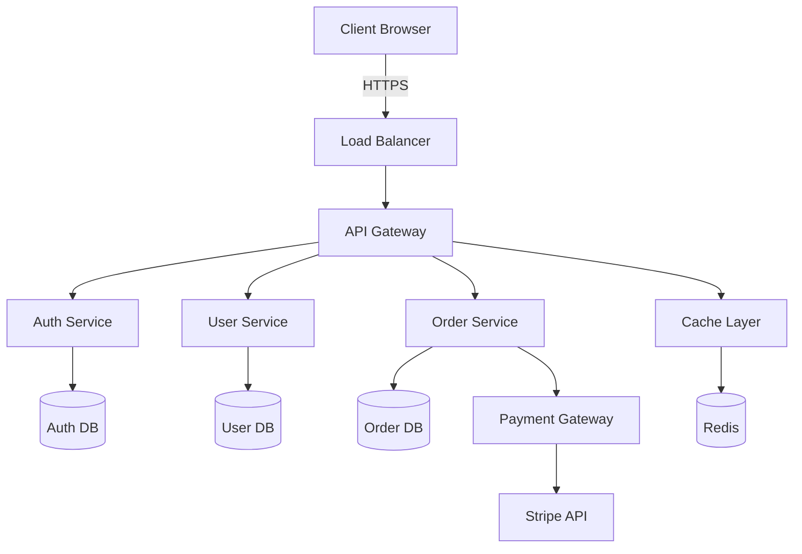
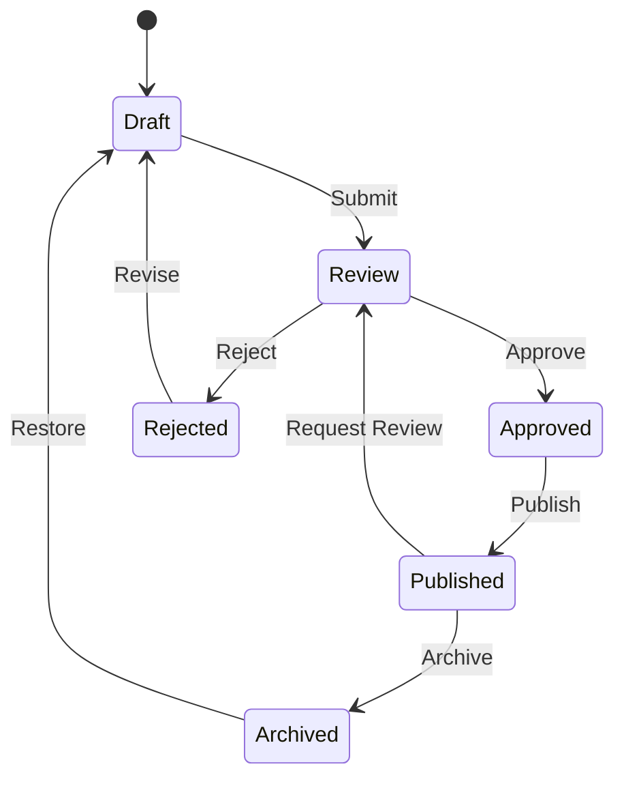
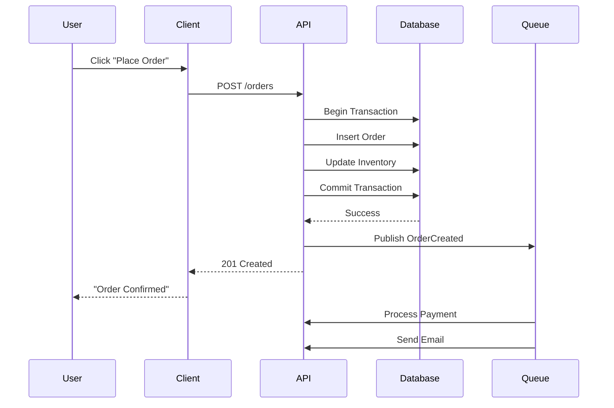

# Performance Test Document

This document is designed to stress-test YAMV's rendering and scrolling performance with a mix of heavy content types.

## Chapter 1: Dense Text

Lorem ipsum dolor sit amet, consectetur adipiscing elit. Sed do eiusmod tempor incididunt ut labore et dolore magna aliqua. Ut enim ad minim veniam, quis nostrud exercitation ullamco laboris nisi ut aliquip ex ea commodo consequat. Duis aute irure dolor in reprehenderit in voluptate velit esse cillum dolore eu fugiat nulla pariatur. Excepteur sint occaecat cupidatat non proident, sunt in culpa qui officia deserunt mollit anim id est laborum.

Curabitur pretium tincidunt lacus. Nulla gravida orci a odio. Nullam varius, turpis et commodo pharetra, est eros bibendum elit, nec luctus magna felis sollicitudin mauris. Integer in mauris eu nibh euismod gravida. Duis ac tellus et risus vulputate vehicula. Donec lobortis risus a elit. Etiam tempor. Ut ullamcorper, ligula ut dictum pharetra, nisi nunc fringilla magna, in commodo elit erat nec turpis. Ut pharetra, purus quis semper blandit, mi enim condimentum enim, ut aliquam eros justo eget ante.

Sed ut perspiciatis unde omnis iste natus error sit voluptatem accusantium doloremque laudantium, totam rem aperiam, eaque ipsa quae ab illo inventore veritatis et quasi architecto beatae vitae dicta sunt explicabo. Nemo enim ipsam voluptatem quia voluptas sit aspernatur aut odit aut fugit, sed quia consequuntur magni dolores eos qui ratione voluptatem sequi nesciunt. Neque porro quisquam est, qui dolorem ipsum quia dolor sit amet, consectetur, adipisci velit, sed quia non numquam eius modi tempora incidunt ut labore et dolore magnam aliquam quaerat voluptatem.

## Chapter 2: Code Blocks

### JavaScript — Event Loop

```javascript
class EventEmitter {
  constructor() {
    this.listeners = new Map();
    this.maxListeners = 10;
  }

  on(event, callback) {
    if (!this.listeners.has(event)) {
      this.listeners.set(event, []);
    }
    const handlers = this.listeners.get(event);
    if (handlers.length >= this.maxListeners) {
      console.warn(`MaxListenersExceededWarning: ${event}`);
    }
    handlers.push(callback);
    return this;
  }

  emit(event, ...args) {
    const handlers = this.listeners.get(event);
    if (!handlers) return false;
    handlers.forEach(handler => handler.apply(this, args));
    return true;
  }

  off(event, callback) {
    const handlers = this.listeners.get(event);
    if (!handlers) return this;
    const index = handlers.indexOf(callback);
    if (index > -1) handlers.splice(index, 1);
    return this;
  }

  once(event, callback) {
    const wrapper = (...args) => {
      callback.apply(this, args);
      this.off(event, wrapper);
    };
    return this.on(event, wrapper);
  }
}
```

### Rust — Async Runtime

```rust
use std::future::Future;
use std::pin::Pin;
use std::task::{Context, Poll, Waker};
use std::sync::{Arc, Mutex};

struct SharedState {
    completed: bool,
    waker: Option<Waker>,
}

pub struct TimerFuture {
    shared_state: Arc<Mutex<SharedState>>,
}

impl Future for TimerFuture {
    type Output = ();

    fn poll(self: Pin<&mut Self>, cx: &mut Context<'_>) -> Poll<Self::Output> {
        let mut shared_state = self.shared_state.lock().unwrap();
        if shared_state.completed {
            Poll::Ready(())
        } else {
            shared_state.waker = Some(cx.waker().clone());
            Poll::Pending
        }
    }
}

impl TimerFuture {
    pub fn new(duration: std::time::Duration) -> Self {
        let shared_state = Arc::new(Mutex::new(SharedState {
            completed: false,
            waker: None,
        }));

        let thread_shared_state = shared_state.clone();
        std::thread::spawn(move || {
            std::thread::sleep(duration);
            let mut shared_state = thread_shared_state.lock().unwrap();
            shared_state.completed = true;
            if let Some(waker) = shared_state.waker.take() {
                waker.wake()
            }
        });

        TimerFuture { shared_state }
    }
}
```

### Python — Data Pipeline

```python
from dataclasses import dataclass, field
from typing import Callable, Iterator, TypeVar, Generic
import functools

T = TypeVar('T')
R = TypeVar('R')

@dataclass
class Pipeline(Generic[T]):
    source: Iterator[T]
    transforms: list[Callable] = field(default_factory=list)

    def map(self, fn: Callable[[T], R]) -> 'Pipeline[R]':
        new = Pipeline(self.source, self.transforms.copy())
        new.transforms.append(lambda data: (fn(item) for item in data))
        return new

    def filter(self, predicate: Callable[[T], bool]) -> 'Pipeline[T]':
        new = Pipeline(self.source, self.transforms.copy())
        new.transforms.append(lambda data: (item for item in data if predicate(item)))
        return new

    def reduce(self, fn: Callable[[R, T], R], initial: R) -> R:
        result = self.execute()
        return functools.reduce(fn, result, initial)

    def execute(self) -> Iterator:
        data = self.source
        for transform in self.transforms:
            data = transform(data)
        return data

    def collect(self) -> list:
        return list(self.execute())
```

## Chapter 3: Tables

### World's Largest Cities

| Rank | City | Country | Population | Area (km²) | Density |
|---:|---|---|---:|---:|---:|
| 1 | Tokyo | Japan | 37,400,068 | 2,194 | 17,044 |
| 2 | Delhi | India | 30,290,936 | 2,072 | 14,618 |
| 3 | Shanghai | China | 27,058,479 | 6,341 | 4,268 |
| 4 | São Paulo | Brazil | 22,043,028 | 7,947 | 2,774 |
| 5 | Mexico City | Mexico | 21,782,378 | 7,854 | 2,773 |
| 6 | Cairo | Egypt | 20,900,604 | 3,085 | 6,776 |
| 7 | Mumbai | India | 20,411,274 | 4,355 | 4,688 |
| 8 | Beijing | China | 20,384,000 | 16,411 | 1,242 |
| 9 | Dhaka | Bangladesh | 21,005,860 | 2,161 | 9,720 |
| 10 | Osaka | Japan | 19,222,665 | 5,107 | 3,764 |
| 11 | New York | USA | 18,819,000 | 12,093 | 1,556 |
| 12 | Karachi | Pakistan | 16,093,786 | 3,780 | 4,258 |
| 13 | Buenos Aires | Argentina | 15,153,729 | 4,758 | 3,185 |
| 14 | Chongqing | China | 15,872,179 | 82,403 | 193 |
| 15 | Istanbul | Turkey | 15,190,336 | 5,461 | 2,782 |

### Programming Language Comparison

| Feature | JavaScript | Python | Rust | Go | TypeScript |
|---|:---:|:---:|:---:|:---:|:---:|
| Static typing | :x: | :x: | :white_check_mark: | :white_check_mark: | :white_check_mark: |
| Null safety | :x: | :x: | :white_check_mark: | :x: | Partial |
| Generics | Partial | :white_check_mark: | :white_check_mark: | :white_check_mark: | :white_check_mark: |
| Pattern matching | :x: | :white_check_mark: | :white_check_mark: | :x: | :x: |
| Memory safety | GC | GC | Ownership | GC | GC |
| Concurrency | Async | Async/Thread | Async/Thread | Goroutines | Async |
| Package manager | npm | pip | cargo | go mod | npm |
| Compilation | JIT | Interpreted | AOT | AOT | Transpiled |
| REPL | :white_check_mark: | :white_check_mark: | :x: | :x: | :x: |
| Speed | Medium | Slow | Fast | Fast | Medium |

## Chapter 4: Mathematics

### Linear Algebra

The determinant of a 3×3 matrix can be computed as:

$$\det(A) = \begin{vmatrix} a_{11} & a_{12} & a_{13} \\ a_{21} & a_{22} & a_{23} \\ a_{31} & a_{32} & a_{33} \end{vmatrix} = a_{11}(a_{22}a_{33} - a_{23}a_{32}) - a_{12}(a_{21}a_{33} - a_{23}a_{31}) + a_{13}(a_{21}a_{32} - a_{22}a_{31})$$

### Fourier Transform

The continuous Fourier transform is defined as:

$$\hat{f}(\xi) = \int_{-\infty}^{\infty} f(x) \, e^{-2\pi i x \xi} \, dx$$

And its inverse:

$$f(x) = \int_{-\infty}^{\infty} \hat{f}(\xi) \, e^{2\pi i x \xi} \, d\xi$$

### Maxwell's Equations

$$\nabla \cdot \mathbf{E} = \frac{\rho}{\varepsilon_0}$$

$$\nabla \cdot \mathbf{B} = 0$$

$$\nabla \times \mathbf{E} = -\frac{\partial \mathbf{B}}{\partial t}$$

$$\nabla \times \mathbf{B} = \mu_0 \mathbf{J} + \mu_0 \varepsilon_0 \frac{\partial \mathbf{E}}{\partial t}$$

### Euler's Identity

The most beautiful equation in mathematics: $e^{i\pi} + 1 = 0$

It connects five fundamental constants: $e$, $i$, $\pi$, $1$, and $0$.

### Bayesian Inference

$$P(A|B) = \frac{P(B|A) \cdot P(A)}{P(B)} = \frac{P(B|A) \cdot P(A)}{\sum_{i} P(B|A_i) \cdot P(A_i)}$$

## Chapter 5: Diagrams

### System Architecture



### State Machine



### Sequence Diagram



## Chapter 6: Mixed Content

### Task List

- [x] Design system architecture
- [x] Set up development environment
- [x] Implement authentication
- [x] Create database schema
- [ ] Build REST API endpoints
- [ ] Write integration tests
- [ ] Set up CI/CD pipeline
- [ ] Deploy to staging
- [ ] Performance testing
- [ ] Security audit
- [ ] Deploy to production
- [ ] Monitor and iterate

### Footnotes

The Rust programming language[^1] was first released in 2015 and has been the "most loved" language in the Stack Overflow developer survey for seven consecutive years[^2]. Its ownership model provides memory safety without garbage collection[^3].

[^1]: Originally designed by Graydon Hoare at Mozilla Research.
[^2]: According to Stack Overflow Annual Developer Surveys 2016–2022.
[^3]: This is achieved through the borrow checker, which enforces rules at compile time.

### Definition List

Concurrency
: The ability of a system to handle multiple tasks by interleaving their execution, giving the appearance of simultaneous progress.

Parallelism
: The actual simultaneous execution of multiple tasks, typically across multiple CPU cores.

Deadlock
: A situation where two or more processes are unable to proceed because each is waiting for the other to release a resource.

Race Condition
: A flaw in a system where the output depends on the sequence or timing of uncontrollable events, leading to unpredictable behavior.

### Blockquotes

> The best way to predict the future is to invent it.
> — Alan Kay

> Any sufficiently advanced technology is indistinguishable from magic.
> — Arthur C. Clarke

> Programs must be written for people to read, and only incidentally for machines to execute.
> — Harold Abelson, *Structure and Interpretation of Computer Programs*

### Highlighted Text

This paragraph contains ==highlighted text== to test the mark rendering. Multiple ==highlights in a single line== should work correctly. Even ==nested **bold** highlights== are supported.

---

## Chapter 7: More Text for Scroll Testing

### The Art of Software Engineering

Software engineering is fundamentally about managing complexity. As systems grow, the interactions between components multiply, and the cognitive load on developers increases exponentially. The key insight of good software design is that we cannot eliminate complexity — we can only manage where it lives.

The single responsibility principle suggests that each module should have one, and only one, reason to change. This doesn't mean each module does one thing; it means each module is responsible to one actor. When we conflate responsibilities, changes for one actor risk breaking functionality for another.

### On Technical Debt

Technical debt is a metaphor that helps us think about the long-term consequences of shortcuts in software development. Like financial debt, it can be a useful tool when taken on deliberately and managed carefully. The problem arises when technical debt accumulates unconsciously, when no one tracks it, and when the interest payments — in the form of slower development, more bugs, and harder onboarding — compound silently.

The most dangerous form of technical debt is the kind that is invisible: architectural decisions that seemed reasonable at the time but that constrain future evolution in ways that only become apparent years later. By then, the original developers may have moved on, the documentation may be sparse, and the cost of remediation may be prohibitive.

### On Testing

Testing is not about finding bugs. Testing is about building confidence. A well-tested system gives developers the confidence to make changes, knowing that if they break something, their tests will catch it. This confidence is what enables velocity — not the absence of bugs, but the knowledge that bugs will be caught early.

The testing pyramid suggests that most tests should be unit tests, with fewer integration tests, and even fewer end-to-end tests. But this is a guideline, not a rule. The right testing strategy depends on the system's architecture, the team's experience, and the cost of failure.

### On Simplicity

Simplicity is the ultimate sophistication. In software, the simplest solution that works is almost always the best solution. Not because simple solutions are easy to create — they're often the hardest — but because they're the easiest to understand, maintain, and extend.

The temptation to over-engineer is strongest when we're uncertain about the future. We add layers of abstraction "just in case," we implement configurable systems for scenarios that may never arise, and we design for scale before we have users. The antidote is discipline: solve the problem you have today, and trust that you can solve tomorrow's problem when it arrives.

Rich Hickey distinguishes between "simple" and "easy." Easy means familiar, close at hand. Simple means not complex, not intertwined. We should always prefer simple over easy, because simplicity pays dividends over the lifetime of a system, while ease is fleeting.

### On Communication

Code is read far more often than it is written. This means that clarity in code is not a luxury — it's a necessity. Every unclear variable name, every cryptic abbreviation, every clever trick that saves a line but costs ten minutes of comprehension is a tax on everyone who reads the code afterward.

Good code communicates its intent. It tells you not just what it does, but why. Comments should explain the "why" when the code cannot; the "what" should be evident from the code itself. If you find yourself writing a comment to explain what a block of code does, consider whether the code could be rewritten to be self-explanatory.

### Final Thoughts

Building software is a human activity. We build systems for humans, with humans, and the constraints we face are as much social and cognitive as they are technical. The best software engineers are not those who write the cleverest code, but those who write the clearest code, who communicate effectively with their teams, and who make thoughtful decisions about where to invest their limited time and energy.

> Perfection is achieved, not when there is nothing more to add, but when there is nothing left to take away.
> — Antoine de Saint-Exupéry
