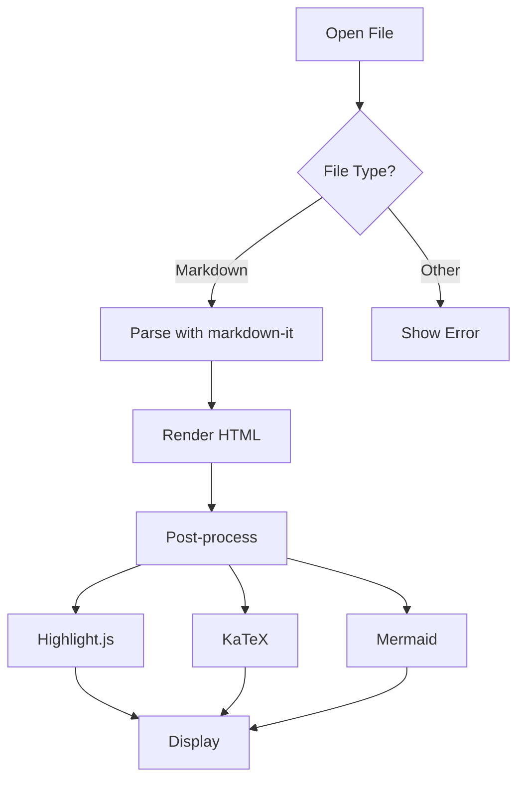
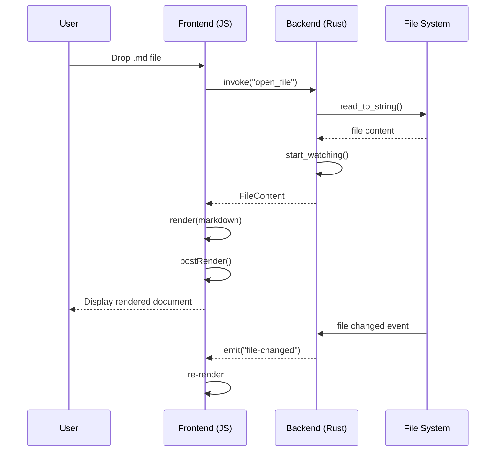
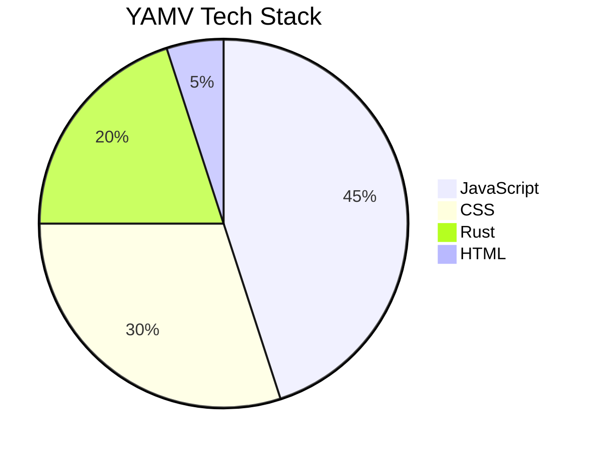

# YAMV Feature Showcase

[[toc]]

## Text Formatting

This is **bold**, *italic*, ~~strikethrough~~, and `inline code`.

You can combine **bold and *italic*** or use ***bold italic*** together.

This is ==highlighted text== using the mark syntax. You can highlight ==entire phrases and sentences== to draw attention. It also works inside **==bold highlights==** and *==italic highlights==*.

## Headings

### Third Level

#### Fourth Level

##### Fifth Level

###### Sixth Level

## Links and Images

[External link to GitHub](https://github.com)

[Internal anchor to Math section](#math)

## Lists

Unordered:

- Item 1
- Item 2
  - Nested item A
  - Nested item B
    - Deeply nested
- Item 3

Ordered:

1. First
2. Second
3. Third
   1. Sub-item
   2. Another sub-item

## Task List

- [x] Set up Tauri v2 project
- [x] Implement markdown-it pipeline
- [x] Add syntax highlighting
- [x] Add KaTeX math support
- [x] Add Mermaid diagrams
- [x] Bear-inspired themes
- [ ] Custom app icon
- [ ] QuickLook extension

## Blockquote

> This is a blockquote with **bold** and *italic* text.
>
> It can span multiple paragraphs.

> Nested blockquotes:
>
> > "The best way to predict the future is to invent it."
> > — Alan Kay

## Table

| Feature | Status | Notes |
|---------|--------|-------|
| Markdown rendering | ✅ Done | markdown-it + plugins |
| Syntax highlighting | ✅ Done | highlight.js |
| Math (KaTeX) | ✅ Done | Inline and block |
| Mermaid diagrams | ✅ Done | Lazy-loaded |
| ==Highlighted text== | ✅ Done | markdown-it-mark |
| Dark theme | ✅ Done | Dark Graphite |
| Light theme | ✅ Done | Red Graphite |

## Code Blocks

### JavaScript

```javascript
const FONT_THEMES = {
  "literata-inter": {
    body: '"Literata Variable", Georgia, serif',
    heading: '"Inter Variable", -apple-system, sans-serif',
    code: '"JetBrains Mono", monospace',
  },
};

function applyTheme(preference) {
  const dark = preference === "dark"
    || (preference === "auto" && matchMedia("(prefers-color-scheme: dark)").matches);
  document.documentElement.setAttribute("data-theme", dark ? "dark" : "light");
}
```

### Rust

```rust
#[tauri::command]
fn open_file(path: String, app: AppHandle) -> Result<FileContent, String> {
    let path = PathBuf::from(&path)
        .canonicalize()
        .map_err(|e| format!("Failed to resolve path: {}", e))?;

    let content = std::fs::read_to_string(&path)
        .map_err(|e| format!("Failed to read file: {}", e))?;

    Ok(FileContent { content, dir, filename })
}
```

### CSS

```css
:root[data-theme="dark"] {
  --color-fg-default: #d8d8d8;
  --color-canvas-default: #1c1e20;
  --color-accent-fg: #74bef7;
}

.markdown-body mark {
  background-color: var(--color-mark-bg);
  color: inherit;
  padding: 0.1em 0.3em;
  border-radius: 3px;
}
```

### Shell

```bash
# Start dev server
source ~/.cargo/env
npx tauri dev

# Build production app
npx tauri build
```

### JSON

```json
{
  "productName": "YAMV",
  "version": "0.1.0",
  "identifier": "com.yamv.viewer",
  "app": {
    "windows": [{
      "titleBarStyle": "Overlay",
      "hiddenTitle": true
    }]
  }
}
```

### Inline code examples

Use `npx tauri dev` to start development. The config lives in `src-tauri/tauri.conf.json`. Run `npm run build` before `npx tauri build`.

## Math

Inline math: The famous equation $E = mc^2$ changed physics forever. Euler's identity $e^{i\pi} + 1 = 0$ is often called the most beautiful equation.

Block math:

$$
\int_0^\infty e^{-x^2} dx = \frac{\sqrt{\pi}}{2}
$$

$$
\sum_{n=1}^{\infty} \frac{1}{n^2} = \frac{\pi^2}{6}
$$

$$
\nabla \times \mathbf{E} = -\frac{\partial \mathbf{B}}{\partial t}
$$

## Mermaid Diagrams

### Flowchart



### Sequence Diagram



### Pie Chart



## Footnotes

YAMV is a native macOS markdown viewer[^1] built with Tauri[^2]. It uses markdown-it[^3] for parsing.

[^1]: YAMV stands for "Yet Another Markdown Viewer."
[^2]: Tauri is a framework for building desktop applications with web technologies and Rust.
[^3]: markdown-it is a fast, pluggable markdown parser with full CommonMark support.

## Emoji

:tada: :rocket: :thumbsup: :heart: :star: :fire: :sparkles: :rainbow:

## Abbreviations

*[HTML]: Hyper Text Markup Language
*[CSS]: Cascading Style Sheets
*[JS]: JavaScript
*[YAMV]: Yet Another Markdown Viewer
*[TOC]: Table of Contents
*[KaTeX]: A fast math typesetting library

YAMV renders HTML content styled with CSS. The JS frontend communicates with a Rust backend. The TOC sidebar uses KaTeX for math rendering.

## Definition List

YAMV
: Yet Another Markdown Viewer — a native macOS app for reading markdown files.

Tauri
: A framework for building lightweight, secure desktop apps with web frontends and Rust backends.

markdown-it
: A fast, pluggable CommonMark-compliant markdown parser for JavaScript.

## HTML Passthrough

<details>
<summary>Click to expand — hidden content with markdown</summary>

This is hidden content with **bold**, *italic*, and `code`.

- List item inside details
- Another item

</details>

Keyboard shortcut: <kbd>Cmd</kbd> + <kbd>O</kbd> to open a file.

## Horizontal Rule

---

## Long Content for Scroll Testing

Lorem ipsum dolor sit amet, consectetur adipiscing elit. Sed do eiusmod tempor incididunt ut labore et dolore magna aliqua. Ut enim ad minim veniam, quis nostrud exercitation ullamco laboris nisi ut aliquip ex ea commodo consequat.

Duis aute irure dolor in reprehenderit in voluptate velit esse cillum dolore eu fugiat nulla pariatur. Excepteur sint occaecat cupidatat non proident, sunt in culpa qui officia deserunt mollit anim id est laborum.

Sed ut perspiciatis unde omnis iste natus error sit voluptatem accusantium doloremque laudantium, totam rem aperiam, eaque ipsa quae ab illo inventore veritatis et quasi architecto beatae vitae dicta sunt explicabo.

Nemo enim ipsam voluptatem quia voluptas sit aspernatur aut odit aut fugit, sed quia consequuntur magni dolores eos qui ratione voluptatem sequi nesciunt. Neque porro quisquam est, qui dolorem ipsum quia dolor sit amet.

---

*End of test document.*
