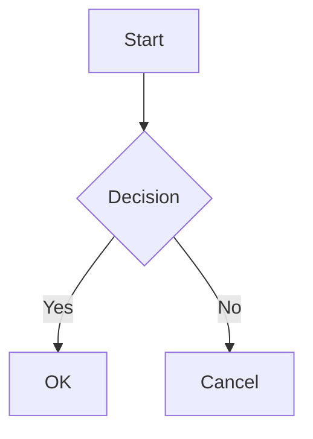

# Heading 1

## Heading 2

### Heading 3

[[toc]]

## Text Formatting

This is **bold**, *italic*, ~~strikethrough~~, and `inline code`.

## Links and Images

[Link to GitHub](https://github.com)

## Lists

- Item 1
- Item 2
  - Nested item

1. First
2. Second

## Task List

- [x] Done
- [ ] Not done

## Blockquote

> This is a blockquote
> with multiple lines

## Table

| Name | Value |
|------|-------|
| Foo  | Bar   |
| Baz  | Qux   |

## Code Block

```javascript
function hello() {
  console.log("Hello, World!");
}
```

## Math

Inline math: $E = mc^2$

Block math:

$$
\int_0^\infty e^{-x^2} dx = \frac{\sqrt{\pi}}{2}
$$

## Mermaid Diagram



## Footnotes

This has a footnote[^1].

[^1]: This is the footnote content.

## Emoji

:tada: :rocket: :thumbsup:

## Abbreviations

*[HTML]: Hyper Text Markup Language
*[W3C]: World Wide Web Consortium

The HTML specification is maintained by the W3C.

## Definition List

Term 1
: Definition 1

Term 2
: Definition 2a
: Definition 2b

## HTML

<details>
<summary>Click to expand</summary>

This is hidden content with **markdown** inside.

</details>

<kbd>Cmd</kbd> + <kbd>Q</kbd> to quit.

## Horizontal Rule

---

End of test document.
